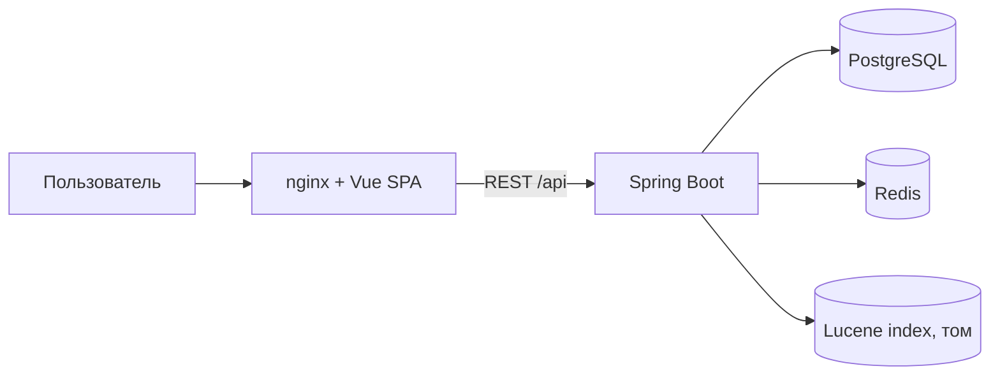

# System Design

Черновик. Стек: см. `CLAUDE.md`. Требования: `docs/requirements.md`. Масштабирование и (отложенный) шаринг: `docs/access-and-scaling.md`. Вопросы к автору кейса: `docs/questions-for-case-author.md`.

**Область черновика:** только изоляция по владельцу (каждый видит свои документы). Шаринг и команды исключены до ответа автора кейса; точки расширения — в разделе 9.

Пометки **[проверить]** — предположения, не проверенные в исходниках.

## 1. Контекст и компоненты

Внутри приложения (один процесс, модульный монолит):

| Модуль | Ответственность |
|---|---|
| `auth` | регистрация, вход, выпуск и проверка JWT; текущий пользователь для остальных модулей |
| `documents` | CRUD документов, версии, метаданные, теги |
| `importer` | приём файлов, папок, архивов; отчёт по каждому файлу |
| `markdown` | парсинг, извлечение frontmatter, структуры и чистого текста, нормализация |
| `indexing` | очередь задач индексации, запись в Lucene |
| `search` | разбор запроса, фильтры, скоринг, подсветка |
| `scoring` | реестр методов скоринга, гибрид |
| `cache` | ключи и инвалидация кэша поиска |
| `stats` | агрегаты для панели статистики |

Монолит, а не микросервисы: Lucene допускает одного писателя на индекс, а команда и срок проекта малы.

## 2. Потоки данных

**Импорт / сохранение документа**
1. `importer` принимает файлы, распаковывает архив, отбрасывает не-`.md`, проверяет размер и кодировку.
2. `markdown` парсит, нормализует, достаёт метаданные и структуру, считает хэш содержимого (дубликат определяется по нему).
3. В одной транзакции PostgreSQL: запись документа, новая версия, теги и задача в таблице очереди индексации (`index_tasks`).
4. Фоновый исполнитель (`IndexWorker`, опрос раз в `INDEX_POLL_MS`) читает пачку `index_tasks`, сворачивает задачи по документу и приводит Lucene в соответствие с PostgreSQL: живой документ — `updateDocument` по id, удалённый или неизвестный — `deleteDocuments`. Затем один коммит индекса и удаление выполненных задач. Задача не хранит действие: оно берётся из текущего состояния документа, поэтому повтор безопасен. При ошибке растёт `attempts` (повтор на следующем опросе), после `INDEX_MAX_ATTEMPTS` задача остаётся в таблице с `last_error`, остальные документы не блокируются.
5. После коммита индекса `LuceneIndex.commit()` увеличивает счётчик поколения индекса в Redis (`INCR index:gen`, см. кэш).

Так индекс не расходится с БД при сбое между шагами: задача не теряется. Полная пересборка индекса из PostgreSQL — отдельная команда администратора.

**Поиск**
1. Запрос → ключ кэша → попадание: вернуть.
2. Промах: разобрать запрос, добавить фильтры (теги, категория, автор, даты) и обязательный фильтр `owner_id = текущий пользователь`, выполнить в Lucene выбранным методом (или методами при гибриде).
3. Гибрид: методы выполняются по одному запросу, оценки каждого списка нормализуются min-max, итог `Σ w_i · score_i`; отсутствующая в списке метода оценка считается 0. Веса приходят в запросе или из настроек пользователя.
4. Подсветка и сниппеты, отсев по БД записей, удалённых после последней фиксации индекса, запись в кэш.

## 3. Схема БД (владелец — единственный субъект доступа)

| Таблица | Ключевые поля |
|---|---|
| `users` | id, email/логин (уникально), хэш пароля, роль, created_at |
| `documents` | id, owner_id → users, title, category, author, current_version, content_hash, size_bytes, word_count, created_at, updated_at, deleted_at |
| `document_versions` | id, document_id → documents, version (уникально с document_id), content (полный текст), extra (JSONB: прочий frontmatter), created_at, created_by |
| `tags` | id, name (уникально) |
| `document_tags` | document_id, tag_id (составной ключ) |
| `index_tasks` | id, document_id, attempts, last_error, created_at (действия и статуса нет: выполненные задачи удаляются, см. раздел 2) |
| `search_settings` | user_id, method, weights (JSONB) |

Таблица прав (`document_shares` или аналог) не создаётся до ответа автора кейса. Каждый запрос к `documents`, версиям, тегам и статистике фильтруется по `owner_id`; теги уникальны в пределах пользователя — **решить**: `tags(owner_id, name)` вместо глобального `name`, иначе имена тегов утекают между пользователями.

Миграции — Flyway, SQL-файлы.

## 4. Индекс Lucene

Один документ индекса на актуальную версию документа. Поля:

| Поле | Тип | Назначение |
|---|---|---|
| `id` | ключ (не анализируется) | `updateDocument` / удаление |
| `title`, `headings`, `body`, `code` | анализируемые (стеммер RU/EN) | текст; буст: заголовок ×3, заголовки разделов ×2, тело ×1, код ×0.5 |
| `tags`, `category`, `author` | не анализируются, для фильтров | фильтры и фасеты статистики |
| `owner_id` | не анализируется | обязательный фильтр изоляции |
| `updated_at`, `size_bytes` | числовые, doc values | сортировка и диапазоны |

**Проверено (Lucene 10.5.1):** нормы у `BM25Similarity` и `ClassicSimilarity` совместимы. Оба используют реализацию `Similarity#computeNorm` по умолчанию, которая кодирует число термов поля через `SmallFloat.intToByte4`; javadoc прямо говорит, что для поставляемых в Lucene классов Similarity можно менять «на лету» без переиндексации. TF-IDF (`TFIDFSimilarity`) вычисляет `lengthNorm` уже при поиске из этого числа, BM25 использует его в своей формуле. Условия: не переопределять `computeNorm`, одинаковый `discountOverlaps` (по умолчанию `true` у `BM25Similarity`; для `ClassicSimilarity` значение по умолчанию не проверялось), поля не должны быть с отключёнными нормами.

Следствие: один индекс, метод выбирается при поиске отдельным `IndexSearcher` на метод (общий `IndexReader`). Не вызывать `setSimilarity` на общем searcher из разных потоков (вывод из устройства API, не проверялось).

## 5. Кэш (Redis)

- Ключ: `user_id` + хэш от нормализованного запроса, фильтров, метода и весов + **счётчик поколения индекса**.
- Инвалидация: любая фиксация изменений в индексе увеличивает счётчик, старые ключи перестают попадать и истекают по TTL. Грубо, но корректно; при низком хит-рейте перейти на счётчик поколения на пользователя (`gen:{user_id}`), тогда правка чужих документов не сбрасывает кэш.
- TTL: `CACHE_TTL_SECONDS`, по умолчанию 300 с; окончательное значение уточнить у автора кейса.
- Redis недоступен: поиск работает без кэша (ошибки логируются). Если недоступен именно `INCR`, записи, сделанные до сбоя, могут отдаваться до истечения TTL.
- Ответ из кэша: `cached=true`, `tookMs` — время выдачи из кэша. Запросы, у которых после анализа не осталось термов, не кэшируются.

## 6. API (набросок; контракт — `docs/openapi.yaml`, в коде генерируется springdoc)

| Метод и путь | Назначение |
|---|---|
| `POST /api/auth/register`, `POST /api/auth/login` | регистрация, выдача JWT |
| `POST /api/import` (multipart: файлы / архив) | импорт, ответ — отчёт по файлам |
| `GET /api/documents`, `GET /api/documents/{id}` | список, документ |
| `PUT /api/documents/{id}`, `DELETE /api/documents/{id}` | правка (новая версия), удаление |
| `GET /api/documents/{id}/versions`, `GET /api/documents/{id}/versions/{n}` | версии |
| `GET /api/search?q=&method=&weights=&tags=&category=&author=&sort=&page=` | поиск |
| `GET /api/search/methods` | список методов скоринга |
| `GET /api/stats` | статистика |
| `GET/PUT /api/settings/search` | метод и веса по умолчанию |
| `POST /api/admin/reindex` | пересборка индекса |

## 7. Нефункциональное

- Конфиг — переменные окружения; логирование и единая обработка ошибок.
- Безопасность: пароли — BCrypt (лимит 72 байта); JWT HS256 (`sub` = id пользователя, `role`, срок `JWT_TTL_SECONDS`), секрет ≥32 байт проверяется при старте; роль ADMIN получает пользователь с email из `ADMIN_EMAIL`; ошибки 401/403 — `application/problem+json`; не сделано: rate limiting входа, отзыв токенов; изоляция данных на уровне запросов; санитизация HTML на клиенте.
- Развёртывание: docker-compose (приложение, PostgreSQL, Redis, nginx); индекс — именованный том.
- Тесты: unit (парсер, токенизация, скоринг), интеграционные с Testcontainers (PostgreSQL, Redis), замер скорости индексации.

## 8. Открытые вопросы

Уровень доступа (шаринг), допустимость Lucene и готовых реализаций BM25/TF-IDF (формулы — `docs/scoring.md`), лимиты и целевые показатели — см. `docs/questions-for-case-author.md`.

## 9. Точки расширения под шаринг

Чтобы ответ автора кейса не потребовал переписывать ядро:
- Проверка доступа — один метод сервиса документов (`canRead/canWrite(user, doc)`); сейчас сравнивает `owner_id`.
- Фильтр индекса строится в одном месте (`AccessFilter`); сейчас — термин `owner_id`, при шаринге — множество субъектов (см. `docs/access-and-scaling.md`).
- Ключ кэша уже содержит `user_id`; при шаринге добавляется набор субъектов.
